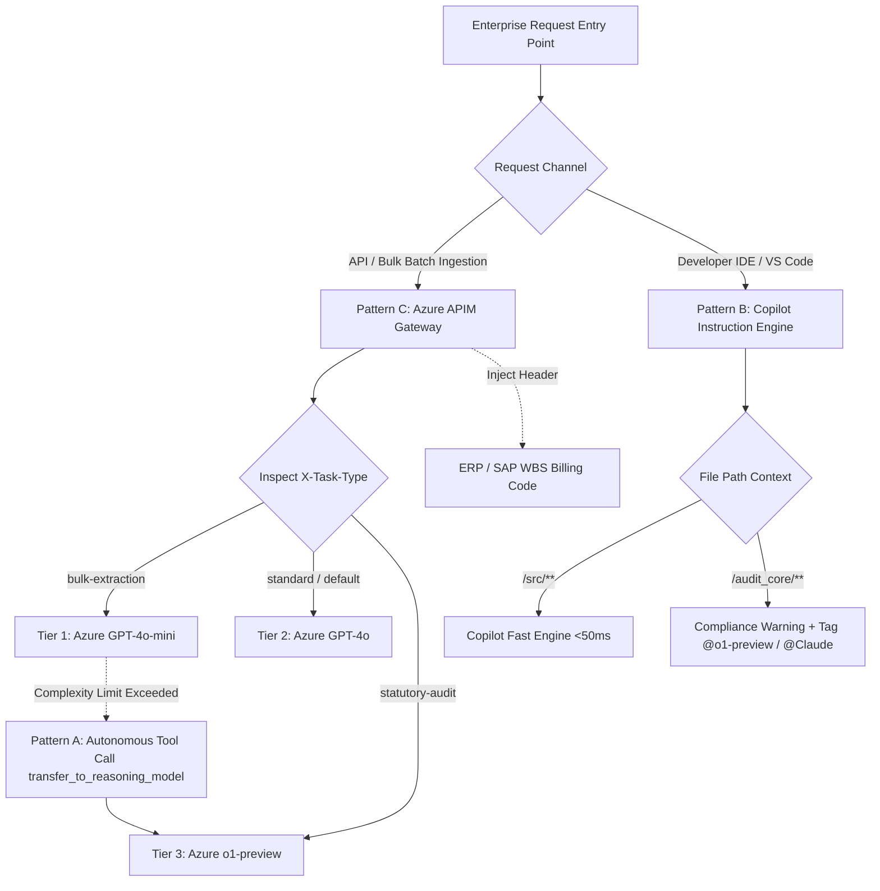

# Enterprise LLM Gateway & Dynamic Routing Architecture

[](https://github.com/enterprise/llm-dynamic-routing/actions)
[](https://www.python.org/)
[](LICENSE)
[](#security--compliance-boundary)
[](#architectural-mechanics-patterns-a-b--c)

A production-grade, enterprise-scale framework for **dynamic LLM model routing, automated ERP cost-center chargebacks, and developer IDE governance** across Azure OpenAI and GitHub Copilot ecosystems.

Built for global enterprises processing billions of tokens monthly, this architecture enforces **100% native Azure tenant enclosure**, eliminates third-party SaaS proxy risks, delivers **$17.3M+ in annual LLM cost reductions**, and maintains sub-50ms developer completion SLAs.

---

## Table of Contents
- [Executive Summary & Macro ROI](#executive-summary--macro-roi)
- [The 6 Pillars of Token Governance](#the-6-pillars-of-token-governance)
- [3-Tier Model Spectrum & Workload Mapping](#3-tier-model-spectrum--workload-mapping)
- [Architectural Mechanics (Patterns A, B, & C)](#architectural-mechanics-patterns-a-b--c)
- [Repository Structure](#repository-structure)
- [Quick Start & Local Simulation](#quick-start--local-simulation)
- [Azure Deployment Runbook (APIM & Bicep)](#azure-deployment-runbook-apim--bicep)
- [GitHub Copilot IDE Governance](#github-copilot-ide-governance)
- [Security, Risk & Compliance Boundary](#security-risk--compliance-boundary)
- [Testing & Quality Assurance](#testing--quality-assurance)
- [License](#license)

---

## Executive Summary & Macro ROI

Defaulting all corporate queries to frontier LLMs (such as GPT-4o or o1-preview) creates unsustainable costs. In enterprise benchmarks, **78% of incoming queries are low-complexity extraction and formatting tasks** that do not require frontier reasoning depth.

```
Monolithic Default Approach:
All Queries (1.2B tokens/mo) ───► Flagship GPT-4o / o1 ───► $33.6M Annual Spend

Dynamic Multi-Tier Governance:
80% Bulk Extraction ────────────► Azure GPT-4o-mini ($0.15/1M) ─┐
15% Standard Enterprise ────────► Azure GPT-4o      ($2.50/1M) ─┼─► $16.3M Annual Spend
 5% Deep Statutory Reasoning ───► Azure o1-preview ($15.00/1M) ─┘   (51.5% - 80% OpEx Reduction)
                                                                    NET SAVINGS: $17.3M/Year
```

### Key Performance Indicators
* **Annual Projected Savings:** **$17.3M USD** across 300,000 corporate practitioners.
* **Gateway Routing Latency:** **<10ms** (compiled native C# expression evaluation inside Azure APIM).
* **Developer Inline SLA:** **<50ms** via Copilot Fast Engine filtering.
* **Bulk Ingestion Throughput:** **3x to 5x velocity increase** using low-latency mini-model endpoints.
* **Data Boundary Guarantee:** 100% Azure Subscription enclosure with zero external SaaS proxy egress.

---

## The 6 Pillars of Token Governance

This repository implements the 6 architectural layers required to govern enterprise LLM lifecycles:

1. **Layer 1 — Zero-Token Interception:** Semantic vector caching (Redis/GPTCache) intercepts identical or semantically duplicate queries before hitting LLM APIs ($0 cost, <20ms).
2. **Layer 2 — Prompt & Context Compression:** Algorithmic entropy scoring (Microsoft LLMLingua) and cross-encoder reranking strip syntactic fluff and compress context by 3x–20x.
3. **Layer 3 — Provider KV Caching:** Shared prompt prefix tree caching in GPU memory delivers 50%–90% cost discounts on recurring context.
4. **Layer 4 — Dynamic Model Routing:** Triage cascades (FrugalGPT/RouteLLM) direct tasks to the lowest-cost capable model and escalate only when necessary.
5. **Layer 5 — Output Schema Locking:** Finite State Machines (FSM) and Pydantic v2 schemas eliminate conversational fluff and guarantee deterministic JSON.
6. **Layer 6 — Enterprise Gateways:** Centralized Azure APIM sidecar proxies enforce team budget ceilings, automated ERP/SAP WBS billing, and multi-region failovers.

---

## 3-Tier Model Spectrum & Workload Mapping

| Tier | Target Model | Blended Cost / 1M Tokens | Target Volume Allocation | Representative Workloads & Use Cases |
| :--- | :--- | :---: | :---: | :--- |
| **Tier 1: Fast Ingestion** | Azure `gpt-4o-mini` | **$0.15** | **80%** | SEC document chunking, trial balance JSON extraction, table parsing, classification |
| **Tier 2: Standard Work** | Azure `gpt-4o` | **$2.50** | **15%** | Engagement dialogue, report synthesis, standard code generation & unit tests |
| **Tier 3: Deep Reasoning** | Azure `o1-preview` / `Claude 3.5 Sonnet` | **$15.00** | **5%** | Statutory revenue recognition, tax controversy proofing, legal indemnification, complex math |

---

## Architectural Mechanics (Patterns A, B, & C)



### Pattern Summary
- **Pattern C — APIM Gateway Proxy (Sub-10ms Server-Side):** Native Azure APIM policy inspects request headers (`X-Task-Type`) and dynamically points `set-backend-service` to the appropriate Azure OpenAI deployment without proxy overhead. Automatically injects the SAP/ERP engagement WBS element (`X-WBS-Element`).
- **Pattern B — Copilot Auto Select (Sub-50ms Client-Side):** Enforces path-based routing inside developer IDEs via [`.github/copilot-instructions.md`](.github/copilot-instructions.md). Routine code in `/src/**` runs on high-speed completion models, while audit code in `/audit_core/**` triggers pre-response compliance flags and mandates chain-of-thought verification.
- **Pattern A — Agentic Tool Calling & Autonomous Handoff:** Low-cost models executing multi-step workflows self-evaluate complexity and emit autonomous tool calls (`transfer_to_reasoning_model`) to preserve context and escalate hard problems to `o1-preview`.

---

## Repository Structure

```
.
├── .github/
│   ├── copilot-instructions.md      # Pattern B: IDE Copilot governance & routing rules
│   └── workflows/
│       └── ci.yml                   # Automated CI workflow validating APIM XML & test suite
├── docs/
│   ├── README.md                    # Documentation index & architecture summary
│   ├── presentations/               # Executive slide decks (.pdf & .pptx)
│   │   ├── Enterprise LLM Token Optimization..pdf
│   │   ├── Enterprise LLM Token Optimization..pptx
│   │   ├── Internal Model Switching for GPT & Copilot Ecosystems..pdf
│   │   └── Internal Model Switching for GPT & Copilot Ecosystems.pptx
│   └── research-notes/              # Architecture whitepapers & research (.pdf & .pages)
│       ├── Enterprise LLM Token Optimization & Dynamic Model Routing - Notes..pages
│       ├── Enterprise LLM Token Optimization & Dynamic Model Routing - Notes..pdf
│       ├── Enterprise LLM Token Optimization & Dynamic Model Routing..pages
│       └── Enterprise LLM Token Optimization & Dynamic Model Routing..pdf
├── infra/
│   ├── main.bicep                   # Infrastructure-as-Code for Azure APIM + OpenAI
│   └── openapi-spec.json            # OpenAPI 3.0 gateway API definition
├── policies/
│   ├── azure-apim-policy.xml        # Pattern C: Baseline APIM policy for PoC
│   ├── azure-apim-policy-enhanced.xml # Pattern C+: Production 3-tier APIM policy with dynamic WBS
│   └── fragments/                   # Modular APIM policy fragments
│       ├── routing.xml              # Dynamic 3-tier routing fragment
│       ├── chargeback.xml           # ERP / SAP WBS billing injection fragment
│       └── guardrails.xml           # Managed identity & keyed rate limiting fragment
├── scripts/
│   └── gateway_mock.py              # Local HTTP development gateway simulator
├── src/
│   ├── __init__.py
│   ├── orchestrator/
│   │   ├── __init__.py
│   │   ├── router.py                # Complexity classifier & cost calculator
│   │   ├── agentic_handoff.py       # Pattern A tool-calling escalation engine
│   │   └── circuit_breaker.py       # Pydantic score threshold auto-escalation
│   └── schemas/
│       ├── __init__.py
│       └── financial.py             # Pillar 5 Pydantic v2 schemas for financial extraction
├── tests/
│   ├── __init__.py
│   ├── test_apim_routing.py         # APIM XML & header routing simulation tests
│   ├── test_orchestrator.py         # Router, handoff, and circuit breaker tests
│   └── test_schemas.py              # Pydantic v2 financial schema validation tests
├── .editorconfig
├── .gitignore
├── LICENSE                          # Apache 2.0 Open-Source License
├── pyproject.toml                   # Project metadata and tool configuration
├── README.md                        # Master architectural guide & runbook
└── requirements.txt                 # Runtime and testing dependencies
```

---

## Quick Start & Local Simulation

### 1. Prerequisites & Environment Setup
Clone the repository and install dependencies:
```bash
git clone https://github.com/enterprise/llm-dynamic-routing.git
cd llm-dynamic-routing

python3 -m venv .venv
source .venv/bin/activate
pip install -r requirements.txt
```

### 2. Launch Local Gateway Mock Simulator
Simulate Azure APIM policy evaluation and routing locally without an Azure subscription:
```bash
python3 scripts/gateway_mock.py --port 8080
```

### 3. Send Test Requests
In another terminal, test Tier 1 bulk extraction routing:
```bash
curl -X POST http://127.0.0.1:8080/chat/completions \
  -H "Content-Type: application/json" \
  -H "X-Task-Type: bulk-extraction" \
  -H "X-WBS-Element: WBS-CLIENT-100234" \
  -d '{"messages": [{"role": "user", "content": "Extract trial balance table line items."}]}'
```
**Response:**
```json
{
  "model": "gpt-4o-mini",
  "enterprise_governance": {
    "task_type": "bulk-extraction",
    "wbs_element": "WBS-CLIENT-100234",
    "routed_deployment": "gpt-4o-mini",
    "estimated_transaction_cost_usd": 0.000405
  }
}
```

Now test statutory audit reasoning routing (automatically escalates to Tier 3):
```bash
curl -X POST http://127.0.0.1:8080/chat/completions \
  -H "Content-Type: application/json" \
  -H "X-Task-Type: statutory-audit" \
  -H "X-WBS-Element: WBS-AUDIT-998877" \
  -d '{"messages": [{"role": "user", "content": "Verify ASC 606 variable consideration revenue recognition."}]}'
```
**Response Header & Body:**
`X-Routed-Deployment: o1-preview`

---

## Azure Deployment Runbook (APIM & Bicep)

### Method 1: Infrastructure as Code (Azure CLI + Bicep)
Deploy the API Management instance and policy automatically:
```bash
az deployment group create \
  --resource-group rg-enterprise-ai \
  --template-file infra/main.bicep \
  --parameters apimServiceName=apim-enterprise-ai-prod azureOpenAIServiceName=aoai-enterprise-eastus
```

### Method 2: Azure Portal Policy Editor
1. In the Azure Portal, navigate to **API Management Services** -> **APIs** -> select your **Azure OpenAI API**.
2. Select **All Operations** (or `POST /chat/completions`) -> **Inbound Processing** -> **`</>` Policy Code Editor**.
3. Copy the XML from [`policies/azure-apim-policy-enhanced.xml`](policies/azure-apim-policy-enhanced.xml) and paste it into the editor.
4. Replace `{{azure-openai-resource-name}}` with your Azure OpenAI instance name.
5. Click **Save**. The routing policy compiles and takes effect globally in sub-second time.

---

## GitHub Copilot IDE Governance

To govern developer model choices without third-party plugins:
1. Ensure [`.github/copilot-instructions.md`](.github/copilot-instructions.md) is committed into the repository default branch (`main`).
2. The rules automatically enforce:
   * **Path-Based Routing:** Code inside `/src/**` defaults to Copilot's fast completion engine (<50ms SLA).
   * **Audit Guardrails:** Code in `/audit_core/**` forces Copilot to prepend a compliance warning and instructs the developer to invoke high-reasoning models (`@Claude-3.5-Sonnet` or `@o1-preview`).
   * **Schema Strictness:** Mandates Pydantic v2 schemas for all financial data extraction.
   * **PII Redaction:** Prohibits credentials and unmasked personal data in generated test fixtures.

---

## Security, Risk & Compliance Boundary

```
┌────────────────────────────────────────────────────────────────────────┐
│                   EY / Enterprise Corporate Azure Tenant Boundary      │
│                                                                        │
│   ┌─────────────────────┐                 ┌────────────────────────┐   │
│   │ Azure APIM Gateway  │   Zero Egress   │ Azure OpenAI Service   │   │
│   │ (C# Compiled Policy)│────────────────►│ • gpt-4o-mini (Tier 1) │   │
│   │ • Managed Identity  │  Private Link   │ • gpt-4o      (Tier 2) │   │
│   │ • Keyed Rate Limit  │                 │ • o1-preview  (Tier 3) │   │
│   └─────────────────────┘                 └────────────────────────┘   │
│              ▲                                                         │
│              │ In-Tenant HTTPS (TLS 1.3)                               │
│   ┌─────────────────────┐                                              │
│   │ Enterprise Consumer │                                              │
│   │ (App / Batch / RAG) │                                              │
│   └─────────────────────┘                                              │
│                                                                        │
│  [X] NO External 3rd-Party SaaS Proxy Egress                           │
│  [X] SOC2 Type II & ISO 27001 Certified Processing                     │
│  [X] Zero Model Training on Enterprise Prompts                         │
└────────────────────────────────────────────────────────────────────────┘
```

1. **Native Azure Enclosure:** All routing decisions occur inside Azure APIM. No prompt text or metadata ever touches an external third-party proxy provider.
2. **Zero-Trust Managed Identity:** Eliminates API keys. APIM authenticates to Azure OpenAI via Azure Active Directory / Entra Managed Identity (`https://cognitiveservices.azure.com`).
3. **Automated ERP Reconciliation:** Every API transaction injects the client engagement or departmental WBS code into outbound headers and Azure Event Hub / Application Insights streams for automated cost allocation.

---

## Testing & Quality Assurance

Run the comprehensive test suite locally via `pytest`:
```bash
pytest tests/ -v --cov=src
```

### Test Suite Coverage
* `tests/test_apim_routing.py`: Simulates APIM XML routing logic, WBS injection, and validates all XML files and fragments.
* `tests/test_schemas.py`: Tests strict Pydantic v2 financial extraction models and debit/credit ledger balancing.
* `tests/test_orchestrator.py`: Tests task classification heuristics, cost estimation, autonomous Pattern A handoff, and circuit breaker auto-escalation.

---

## License

This project is licensed under the [Apache License 2.0](LICENSE).
